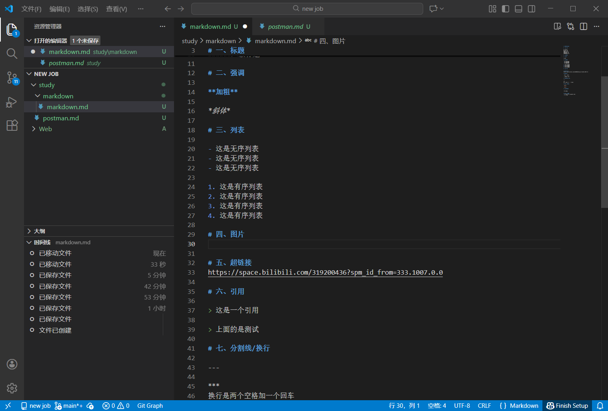

# 笔记Markdawn

# 一、标题

#一级标题
##二级标题
###三级标题
####四级标题
#####五级标题
######六级标题

# 二、强调

**加粗**

*斜体*

# 三、列表

- 这是无序列表
- 这是无序列表
- 这是无序列表

1. 这是有序列表
2. 这是有序列表
3. 这是有序列表
4. 这是有序列表

# 四、图片


# 五、超链接
https://space.bilibili.com/319200436?spm_id_from=333.1007.0.0

# 六、引用

> 这是一个引用

> 上面的是测试

# 七、分割线/换行

---

***
换行是两个空格加一个回车

# 八、行内代码

`<addr>`

`<addr>`

# 九、代码块

```
中间是代码
```

# 十、任务列表
- [x] this is a complete item
- [ ] 测试

